## English

ANimeTracking is an app for you to keep the tracking of your favorite anime shows. This was possible thanks to the Jikan API, Jikan.Net and MyAnimeList website.

### Features:

- Check animes per season
- Check all animes from all time
- Filter by genres, sort by start date or title
- Favorite animes and see them ordered by week day
- Filter favorited animes by broadcast(day of week) and genres
- Get recommendations based on your favorited animes
- Mass favorite animes
- Favorite anime characters and voice actors
- See details about anime characters and voice actors

### Supported Languages

- English (en-US)
- Portuguese (pt-BR)

Supported language don't include text from MyAnimeList Databases (only en-US is available in this case).

## Português

ANimeTracking é um aplicativo para você manter registro dos seus shows favoritos de animes. Isso foi possível graças a Jikan.API, Jikan.Net e o site MyAnimeList.

### Funcionalidades:

- Ver animes por temporada
- Ver todos os animes de todos os tempos
- Filtre por gênero, ordene por data inicial ou por título
- Favorite animes e os veja ordenados pelo dia da semana
- Filtre animes favoritados pela transmissão(dia da semana) e gêneros
- Receba recomendações com base nos seus animes favoritados
- Favorite vários animes de uma só vez
- Favorite personagens de animes e dubladores
- Veja detalhes sobre personagens de animes e dubladores

### Linguagens Suportadas

- Inglês (en-US)
- Português (pt-BR)

Linguagens suportadas não incluem o texto recebido do banco de dados do MyAnimeList (somente en-US é suportado para esse caso).

## App

### Light Mode

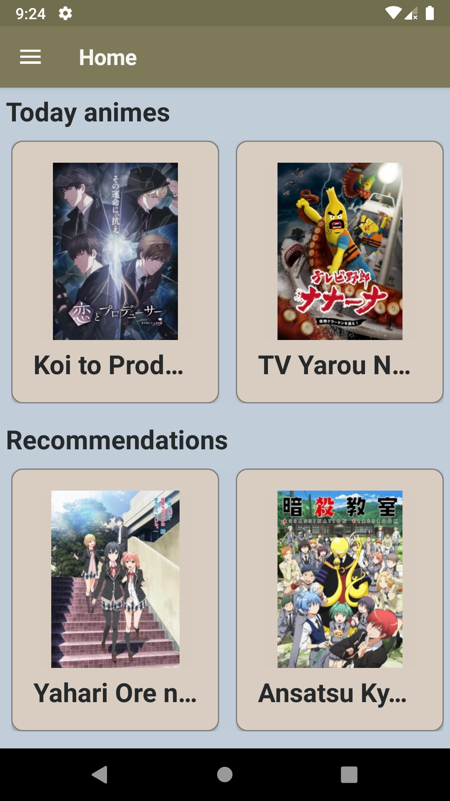 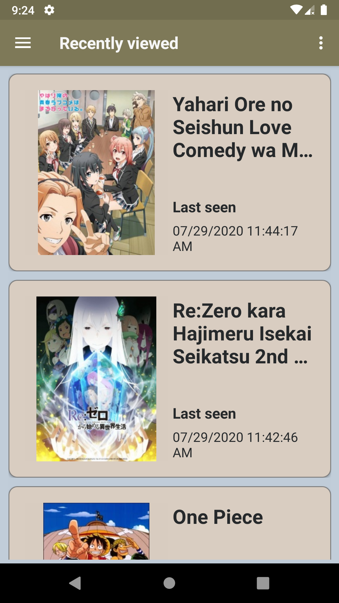 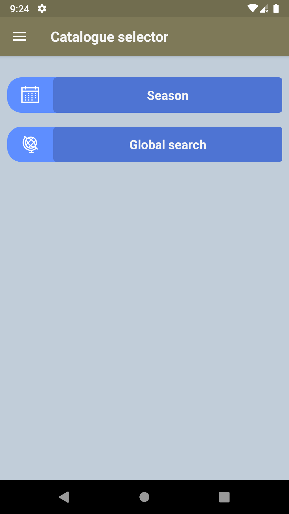 
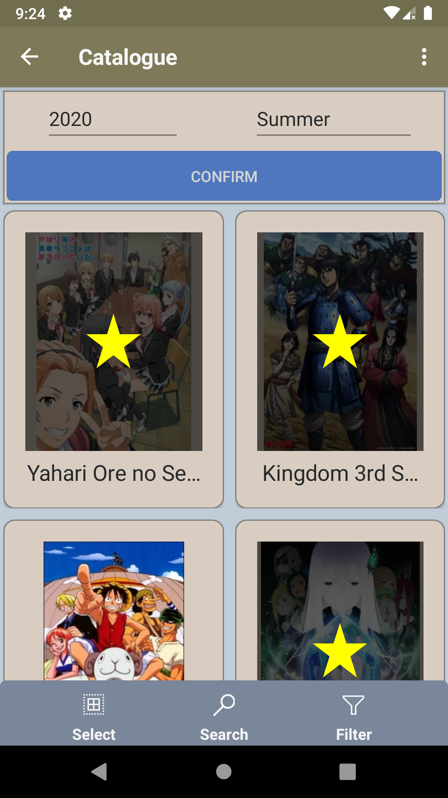 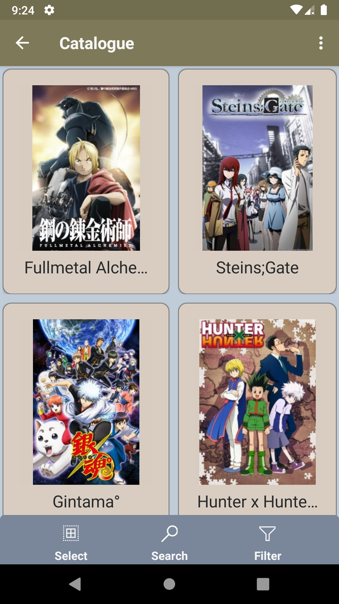 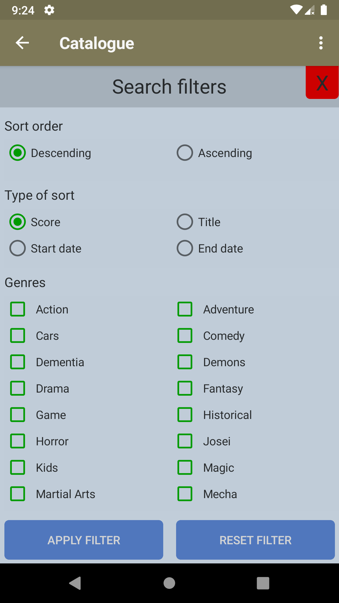

### Dark Mode

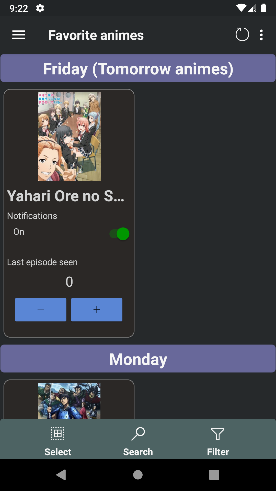 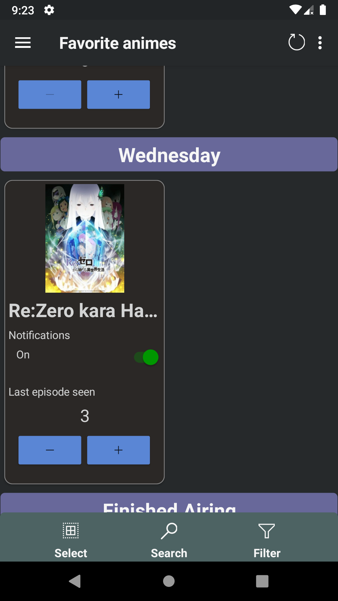 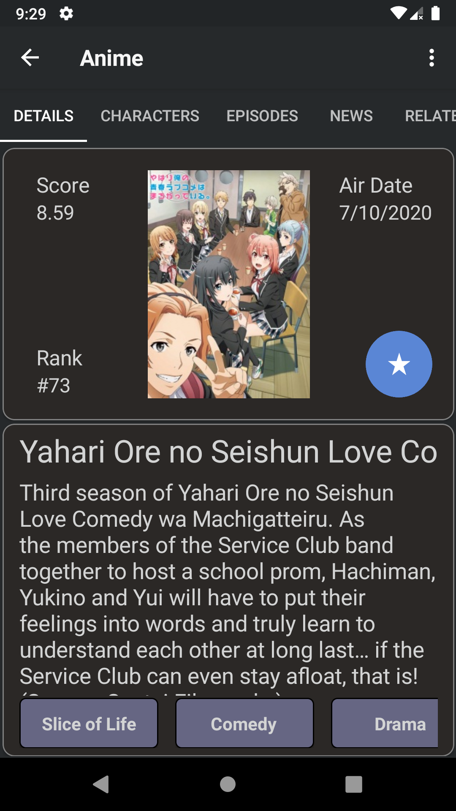 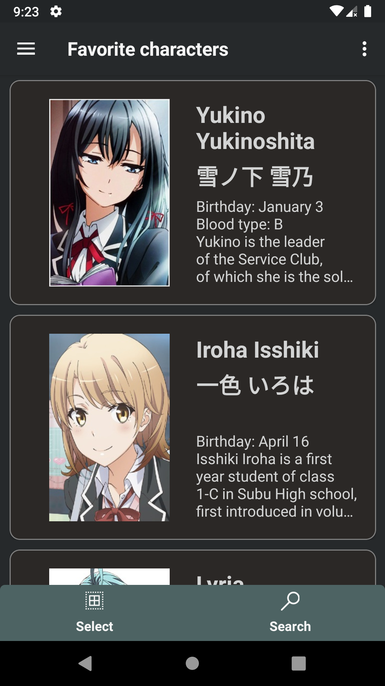 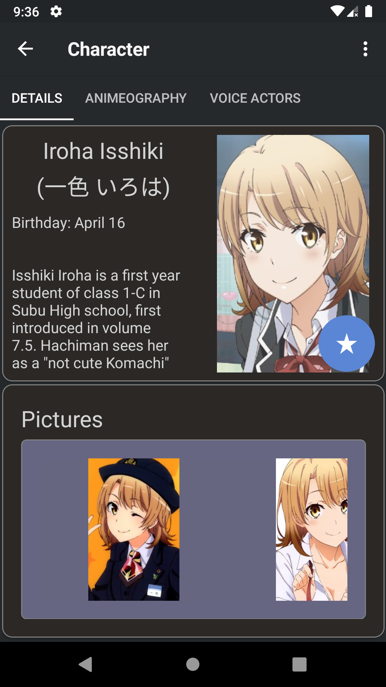 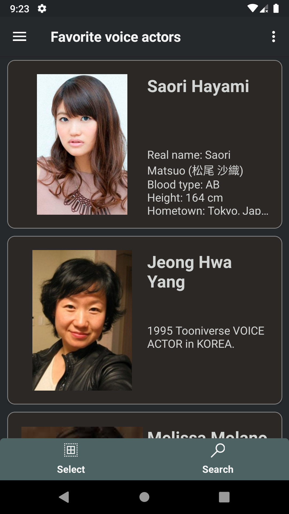 
